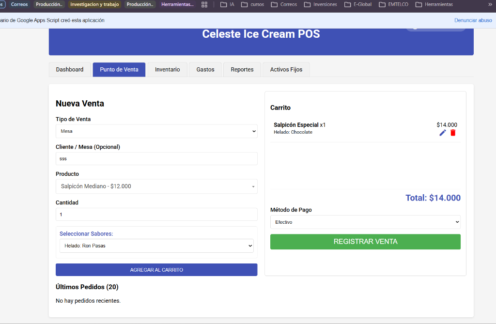
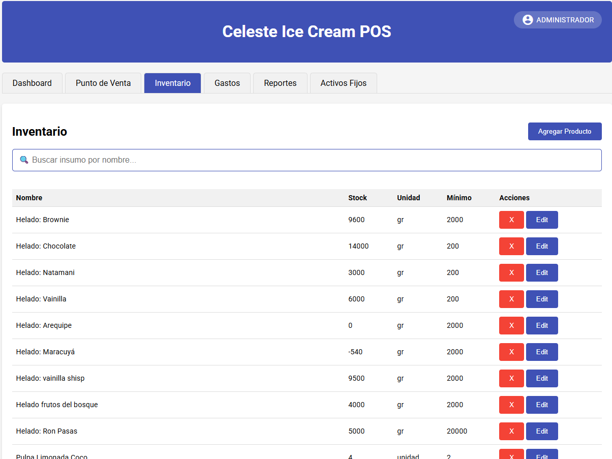
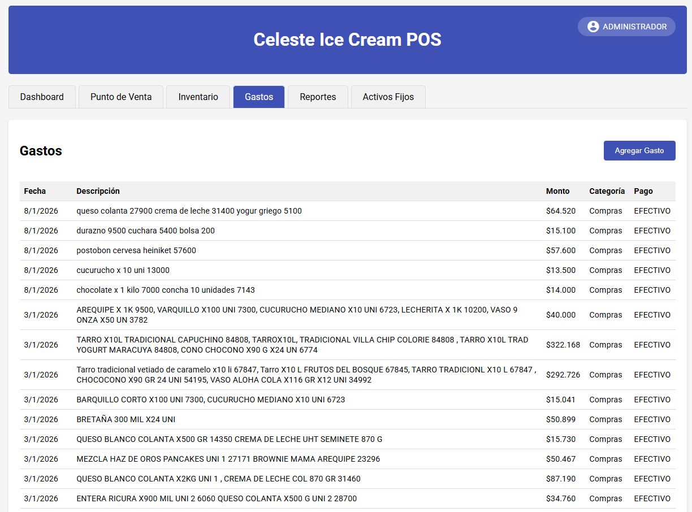
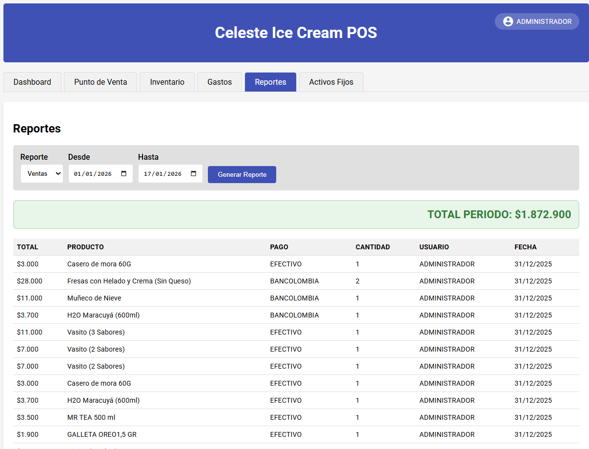
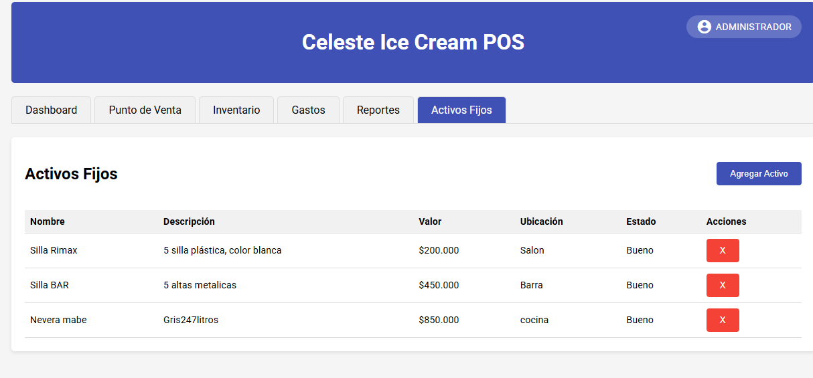

# 🍦 Celeste POS - Sistema de Gestión para Retail

**Celeste POS** es una solución integral de Punto de Venta (POS) y Gestión de Inventario basada en la nube, diseñada específicamente para optimizar la operación de pequeños y medianos comercios (Heladerías, Cafeterías, Retail).

Desarrollado con una arquitectura **Serverless** utilizando el ecosistema de Google, elimina costos de infraestructura y garantiza alta disponibilidad.

---

## 💡 Beneficios del Sistema

Implementar Celeste POS transforma por completo la administración de tu negocio:
* ⏱️ **Ahorro de Tiempo:** Automatiza tareas repetitivas y reportes manuales, ahorrando decenas de horas semanales en conciliaciones.
* 📈 **Control Total del Negocio:** Monitorea ingresos, gastos, e inventario en tiempo real, desde cualquier lugar y en cualquier dispositivo.
* 🚫 **Prevención de Pérdidas:** El control estricto de recetas e ingredientes evita fugas de inventario y descuadres de caja.
* 🤝 **Mejor Experiencia del Cliente:** Facturación ultra rápida y sin errores que agiliza las filas y mejora la atención.
* 📉 **Cero Costos de Servidor:** Al utilizar Google Workspace, no hay cobros mensuales por hosting o bases de datos externas.

---

## 🚀 Características Principales

### 📊 Dashboard en Tiempo Real
* Visualización instantánea de ventas del día y del mes.
* Gráficos dinámicos (Chart.js) para análisis de métodos de pago y tipos de venta (Mesa/Llevar).
* Alertas automáticas de stock bajo.

### 🛒 Punto de Venta (POS) Ágil e Inteligente
* Interfaz optimizada para pantallas táctiles y escritorio.
* Buscador inteligente de productos.
* Gestión de productos compuestos (ej: Helado de 2 sabores) con descuento de inventario automático.
* **Sistema Avanzado de Pedidos:** 
  * Edición de pedidos recientes directamente desde la interfaz.
  * Modificación de sabores en tiempo real con recálculo automático y restauración de inventario (evitando duplicidades).
  * Detección inteligente de método de pago de pedidos previos.
* Prevención de doble facturación (Double Submission Protection).
* Soporte para múltiples métodos de pago (Efectivo, Transferencias, Tarjetas).

### 📦 Gestión de Inventario Avanzada
* **Producto Directo:** Crea un insumo y publícalo para la venta en un solo paso.
* **Recetas:** Descuento automático de ingredientes (gramos/unidades) al vender un producto final.
* **Anti-Duplicados:** Validación lógica para evitar registros repetidos.
* **Soft Delete:** Sistema de seguridad que evita la pérdida de datos históricos al eliminar productos.

### 🛡️ Seguridad y Auditoría
* **Login de Usuarios:** Identificación de cajeros y administradores.
* **Logs de Auditoría:** Registro automático de cada acción (Venta, Edición, Borrado) en una hoja oculta.
* **Alertas por Correo:** Envío automático de reporte de cierre diario y alertas de stock crítico al administrador.

---

## 🛠️ Tecnologías Utilizadas

* **Backend:** Google Apps Script (JavaScript en la nube).
* **Base de Datos:** Google Sheets (Estructurada como BBDD Relacional).
* **Frontend:** HTML5, CSS3 (Material Design), JavaScript.
* **Librerías:** Chart.js (Gráficos), jQuery, Select2 (Búsquedas).

---

## 📋 Requisitos de Instalación

Para implementar tu propia versión de Celeste POS:

1.  **Base de Datos:**
    * Crea una Hoja de Cálculo de Google nueva.
    * Crea las pestañas: `Inventario`, `Productos`, `Ventas`, `Gastos`, `Activos`, `Logs`.
    * *Nota: Asegúrate de configurar los encabezados correctamente.*

2.  **Código:**
    * Abre la hoja de cálculo, ve a `Extensiones > Apps Script`.
    * Crea un archivo `Index.html` y pega el contenido del archivo `index.html` de este repositorio.
    * Pega el código del servidor en el archivo por defecto `Código.gs` copiando el contenido de `Código.gs` de este repositorio.

3.  **Configuración:**
    * En el archivo `Código.gs`, busca la variable `SPREADSHEET_ID` y pega el ID de tu hoja de cálculo.
    * Configura tu correo en `ADMIN_EMAIL` (si aplica en futuras versiones).

4.  **Despliegue:**
    * Haz clic en `Implementar` > `Nueva implementación` > `Aplicación web`.
    * Configura "Quién tiene acceso" como "Cualquier persona" (o según tu necesidad).

---

## 📸 Galería de Capturas

| **Dashboard Principal** | **Punto de Venta (POS)** |
|:---:|:---:|
|  |  |
| **Vista general de ventas e inventario bajo** | **Interfaz de facturación rápida** |

| **Inventario** | **Gestión de Gastos** |
|:---:|:---:|
|  |  |
| **Control de existencias y recetas** | **Registro de egresos y categorías** |

| **Reportes** | **Activos Fijos** |
|:---:|:---:|
|  |  |
| **Histórico de ventas y filtros** | **Control de equipos y mobiliario** |

---

## 📄 Licencia

Este proyecto es de uso libre para fines educativos.
Desarrollado por [John Fredy Muñoz](https://www.linkedin.com/in/jfmu%C3%B1oz/).
